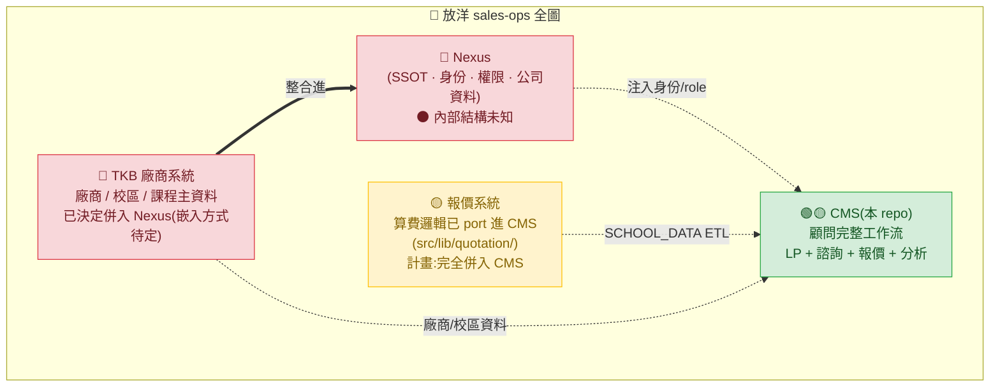
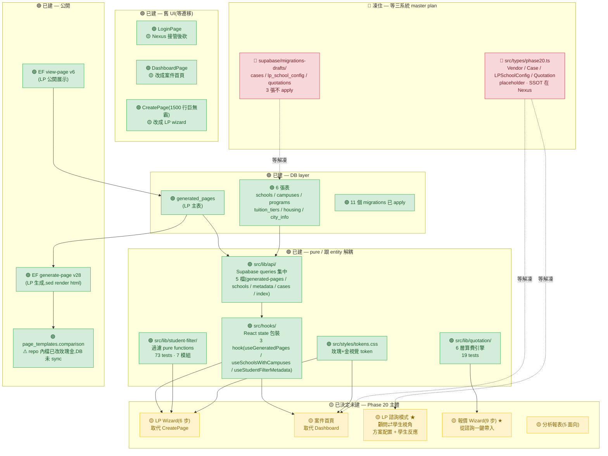
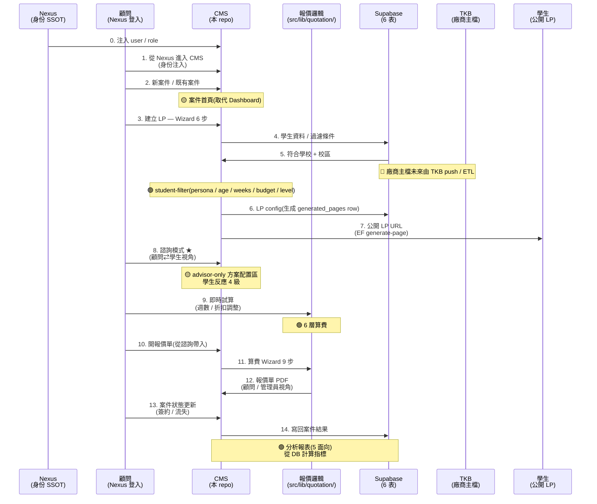

# ARCHITECTURE.md — 三系統合併全圖(俯視)

**目的**:給 jojo 自己重新看清楚全局,**不是給其他 chat / 主管 / 工程師看**(他們要的版本另寫)。
**最後更新**:2026-06-19
**配套文件**:[PROJECT_STATUS.md](./PROJECT_STATUS.md)(執行進度)/ [ROADMAP.md](./ROADMAP.md)(Phase 列表)/ [design/](./design/)(UI 設計 spec)

> 本檔負責「**長怎樣**」 — 系統 / 介面 / 資料 / 流程的俯視
> 那兩份負責「**做到哪**」 — 哪 commit / 哪 phase / 哪卡點

---

## 標註說明

| 顏色 | 意思 |
|---|---|
| 🟢 已建 | 已 commit 到 main,可用 |
| 🟡 已決定未建 | 方向拍板但程式碼沒做(等三系統 master plan 解凍訊號)|
| 🔴 待 master plan | 還沒拍板,等三系統合併規劃 |
| ⚫ 黑盒子 | 我這條 chat 看不到內部,只知道介面點 |

---

## 1. 三系統 + Nexus(俯視)



### 三系統 + Nexus 的角色

| 系統 | 角色 | 狀態 | SSOT 範圍 |
|---|---|---|---|
| **Nexus** | 中樞 / 身份 / 權限 / 公司資料 | 🔴 內部結構 chat 看不到 | accounts / auth / role / 員工資料 / 公司資料 |
| **CMS**(本 repo) | 顧問前線工作台(LP+諮詢+報價+分析) | 🟢 主線 / 已大量建好 | 學生 case(MVP)/ LP 配置 |
| **報價系統** | 算費邏輯 + SCHOOL_DATA | 🟢🟡 算費邏輯已 port 進 CMS(`src/lib/quotation/`),原 repo 在 chat 視野外,計畫:邏輯併入 CMS | 算費規則(6 層)/ 廠商配置(SCHOOL_DATA) |
| **TKB 廠商系統** | 廠商 / 校區 / 課程 / 住宿主資料 | 🔴 已決定併入 Nexus(怎麼合併待定) | 廠商主檔(代理合約 / 退傭規則)/ 校區主檔 |

### Phase 20 真實範圍

> 不是「CMS 單系統重寫」,是「**sales-ops 整套工作流的 underlying data model 重組**」。
> SSOT 規則先定 → schema 對齊 → 三系統真正合併 → 才能講 UI 整合。
> 真實時程:**3-6 個月**(不是原估的 1-2 個月)。

---

## 2. CMS 內部架構(現況 + 目標)



### 內部 layer 分工

```
┌─────────────────────────────────────────────────────┐
│ Pages(舊 LoginPage / DashboardPage / CreatePage)    │
│ 🟡 將被 5 大區塊取代                                  │
├─────────────────────────────────────────────────────┤
│ Hooks(src/hooks/)                                    │
│ ── React state · loading / error / refetch            │
├─────────────────────────────────────────────────────┤
│ API(src/lib/api/)                                    │
│ ── Supabase queries · fail throw · 不做業務邏輯       │
├─────────────────────────────────────────────────────┤
│ Pure Modules(src/lib/quotation/ + student-filter/)   │
│ ── 算費 / 過濾 / 純函式 · 跟 entity 解耦              │
├─────────────────────────────────────────────────────┤
│ Supabase(6 張表 + 2 EF + page_templates)             │
│ ── DB / EF 是業務邏輯落地                             │
└─────────────────────────────────────────────────────┘

紅線:Pages → Hooks → API → Supabase(同方向),不准 Pages 直接接 supabase。
```

### 已建 piece 總覽

| Piece | 位置 | 命中數 | 用途 |
|---|---|---|---|
| 🟢 算費引擎 | `src/lib/quotation/` | 4 檔 + 19 tests | 6 層算費 port from app.js |
| 🟢 學生過濾 | `src/lib/student-filter/` | 7 模組 + 6 test 檔(73 tests) | CEFR / persona / age / weeks / budget / english-level |
| 🟢 API 層 | `src/lib/api/` | 5 檔 | Supabase queries 集中 |
| 🟢 Hooks 層 | `src/hooks/` | 3 hook + index | React state 包裝 |
| 🟢 視覺 token | `src/styles/tokens.css` | 1 檔 | 玫瑰+金 |
| 🟢 設計 spec | `design/` | 6 檔 | 5 大區塊 / 18 情境 / 21 元件 / T1-T8 |
| 🛑 Phase 20 type | `src/types/phase20.ts` | 1 檔(凍住) | placeholder |
| 🛑 Migration drafts | `supabase/migrations-drafts/` | 5 檔(部分凍住) | vendors / tuition_tiers ext 可獨立評估;cases / lp_school_config / quotations 凍住 |
| 🟢 DB | Supabase | 6 表 + 2 EF + 11 migrations | 主資料 |

### CMS 在 Phase 20 的 5 大區塊

| # | 區塊 | 設計狀態 | 實作狀態 | 取代誰 |
|---|---|---|---|---|
| 1 | **案件首頁**(MVP) | 🟢 design 定案 | 🟡 未實作 | DashboardPage |
| 2 | **LP 產生器 Wizard**(6 步) | 🟢 design 定案 | 🟡 未實作 | CreatePage |
| 3 | **LP 諮詢模式 ★** | 🟢 design 定案 | 🟡 未實作 | 新功能 |
| 4 | **報價 Wizard ★**(9 步) | 🟢 design 定案 | 🟡 未實作 | 取代外部報價系統 |
| 5 | **分析報表**(5 面向) | 🟢 design 定案 | 🟡 未實作 | 新功能 |

> 全部 🟡:設計拍板但**等 Phase 20 entity 解凍** + Nexus 對齊版才啟動。

---

## 3. 報價系統 — 已 port 算費邏輯,等併入 CMS

> 倉:`jojo880714/FY-quotation-system-EP-`(vanilla JS,本 repo 內**不存在**,只有 port 過來的算費邏輯)

### 算費 6 層(已 port 進 `src/lib/quotation/`)

```
原始 SCHOOL_DATA 報價
   │
   ▼
┌───────────────────────────────────────────┐
│ Layer 1 · 課程 raw cost(週數 × 階梯定價)  │
│ ── tier 結構:[{wf, wt, price, fixed, peak}] │
│ ── 計價單位:按週 / 按堂 / 固定金額 / 按天    │
├───────────────────────────────────────────┤
│ Layer 2 · 住宿 raw cost                    │
│ ── 同 tier 結構                            │
├───────────────────────────────────────────┤
│ Layer 3 · 雜費 raw cost                    │
│ ── 註冊費 / 機場接送 / 教材費(固定)      │
├───────────────────────────────────────────┤
│ ── 小計(原幣)                            │
├───────────────────────────────────────────┤
│ Layer 4 · 廠商折扣(%)                     │
│ ── 配額 / 季度 promo                        │
├───────────────────────────────────────────┤
│ Layer 5 · FX 換算(原幣 → TWD)            │
│ ── + 匯差緩衝(管理員可見)                │
├───────────────────────────────────────────┤
│ Layer 6 · 公司端                          │
│ ── 公司折扣 / 學校 promo / 營業稅 5%       │
└───────────────────────────────────────────┘
   │
   ▼
最終 =(課程 + 住宿 + 雜費)×(1 − pct) − fixed − schoolDiscount

顧問版可見:小計(原幣)→ 廠商折扣 → 小計(換算)→ 公司折扣 → 營業稅 → 總計
管理員版額外:匯差緩衝 / 顧問獎金 / 廠商退傭 / 淨利 / 淨利率
```

### SCHOOL_DATA 結構(舊系統 app.js 內)

```
SCHOOL_DATA(478KB JSON)
└─ vendors(5 家:EP / ILSC / EC / Kaplan / SGIC)
   └─ campuses
      ├─ courses
      │  └─ tiers:[{wf, wt, price, fixed, peak, unit}]
      ├─ accomm
      │  └─ tiers:[{wf, wt, price, fixed, peak, unit}]
      └─ fees(註冊 / 接送 / 教材)
```

### 廠商 + 校區(部分,以 SCHOOL_DATA JSON 為完整清單)

| 廠商 | 主要校區(部分例子)| 計價特殊性 |
|---|---|---|
| **EP**(English Path)| Sydney / Auckland / 多倫多 | unit 按週 + tier 階梯 |
| **ILSC** | Toronto / Vancouver / Brisbane | unit 多元(按堂 / 按週)|
| **EC** | Brighton / Cambridge / 紐約 | 標準週費 + tier |
| **Kaplan** | London / Manchester / Sydney | 季度 peak 加價 |
| **SGIC** | Sydney / Adelaide | 標準週費 |

> ⚠ **校對提示**(B1 + B2 待 source-of-truth 對齊):
> - 廠商 5 家清單 = 報價系統 SCHOOL_DATA 478KB 內容的 chat 記憶版本,**實際合作清單應跟報價系統 chat 校對**(可能有新增 / 砍掉)
> - 主要校區欄只是部分例子,**完整清單以 SCHOOL_DATA JSON 為準**
> - 三系統 master plan 落地時這節要重寫,屆時順帶把以上對齊掉

### 報價系統 → CMS 整合方式(計畫)

```
舊:報價系統獨立 vanilla JS app · 顧問雙開 CMS + 報價
新:報價邏輯併進 CMS · 從諮詢一鍵帶入 · CMS 出 PDF

整合步驟(🟡 全部已決定未建):
1. 算費引擎 port → ✅ 已 commit(src/lib/quotation/)
2. SCHOOL_DATA → CMS DB(ETL)→ 🟡 等 T1 拍板(tuition_tiers 加 fixed/peak/unit)
3. 報價 Wizard 9 步 UI → 🟡 等 Phase 20 解凍
4. PDF 出單(html2canvas → PNG / PDF)→ 🟡 等 T4 拍板樣式
5. 廠商退傭規則 → ⚫ 等 TKB 廠商系統對齊
```

---

## 4. TKB 廠商系統 — 已決定併入 Nexus,內部待揭露

> 🔴 **已決定併入 Nexus**(jojo 拍板),待定的是嵌入方式 + 內部 schema 揭露。
> ⚫ chat 看不到內部。已知:
> - 廠商主資料 + 校區 + 課程 + 退傭規則的 owner
> - 跟報價系統的 SCHOOL_DATA 有 overlap(可能是 SCHOOL_DATA 的源頭)

### 對 CMS / 報價的影響

| 介面點 | 我知道的 | 我不知道的 |
|---|---|---|
| **廠商主檔** | CMS 要顯示廠商(EP/ILSC...)| TKB 怎麼推 / API 還是 ETL |
| **校區主檔** | CMS 要顯示校區 | 校區欄位 schema |
| **課程定價** | tier 結構(報價邏輯)| TKB 是否能直接出 tier 格式 |
| **退傭規則** | 算費 Layer 6 要用 | 退傭規則的 owner 是 TKB 還是 Nexus |

### 待 jojo 補

- [ ] TKB 廠商系統的 entity schema?
- [ ] TKB 在 Nexus 中的嵌入形式?(子模組 / micro-frontend / 完全融合)
- [ ] CMS 跟 TKB 的介接方式?(API? webhook? 定期 ETL?)
- [ ] 廠商更新 SCHOOL_DATA 時的傳播路徑?(T6 鎖價問題的源頭)

---

## 5. Nexus(SSOT)— 等對齊

> 🔴 已知 Nexus 是 SSOT,但內部結構 chat 看不到。

### 已決定:Nexus 接管的範圍

| 範圍 | 在 CMS 怎麼用 |
|---|---|
| **身份 / SSO** | LoginPage 砍掉,Nexus 注入 user |
| **role / 權限** | CMS 認 advisor / manager 兩級(從 Nexus 傳)|
| **員工資料** | CMS 顯示「目前顧問」資訊從 Nexus 拿 |
| **公司資料** | 報價 PDF 上的公司資訊從 Nexus 拿 |
| **整合介面** | CMS 嵌入 Nexus 子模組(iframe? micro-frontend?)|

### 等對齊的問題(阻擋 master plan)

| # | 問題 | 阻擋什麼 |
|---|---|---|
| **T3** | role mapping(advisor/manager/admin)| 報價管理員視角 / 紅線「移除 PIN」|
| **N1** | Nexus 嵌入方式(iframe / micro-frontend / 完全融合)| CMS 整體 UI 架構 |
| **N2** | Nexus 設計系統 token | 玫瑰金 token 是否要替換 |
| **N3** | 三系統 schema 對齊版 | Phase 20 entity 解凍 |
| **N4** | TKB 廠商在 Nexus 中的嵌入方式 + schema 揭露 | 廠商主檔 owner |

### 待 jojo 確認 / 跟 Nexus chat 對齊

- [ ] Nexus 開發者問題清單 Batch 1 寫了嗎?
- [ ] Nexus 有沒有自己的 schema 文件?
- [ ] Nexus 是否已經有 CMS 嵌入的設計?

---

## 6. 資料流(顧問操作全程)



---

## 7. 能不能做(凍 / 不凍)

> 本節回答「**哪些動作會破壞凍住承諾**」(❌ 不能做)vs「**哪些動作 safely 可以做**」(✅ 可以做)。
> 跟 §8 區分:§7 = 能 / 不能,§8 = 做 / 未做。

### 🛑 凍住(直到三系統 master plan + Nexus schema 對齊)

| 項目 | 為什麼凍 |
|---|---|
| `src/types/phase20.ts` 擴張 | SSOT 在 Nexus,定稿前的 type 都會重寫 |
| `migrations-drafts/` 內 `cases` / `lp_school_config` / `quotations` apply | 同上,schema 變動會推翻 |
| Phase 20a-j 子階段啟動 | 沒對齊基底就建 UI = 重工風險 |
| Claude Design brief 擴大 | 同上 |

### ✅ 不影響(可繼續做,因為 pure / 跟 entity 解耦)

| 項目 | 為什麼可以 |
|---|---|
| `src/lib/quotation/` 擴增測試 | 算費邏輯純函式,不依賴 entity |
| `src/lib/student-filter/` 加新過濾條件 | 同上 |
| `src/lib/api/` / `src/hooks/` 加新查詢 | API 改 entity 重寫成本低 |
| `src/styles/tokens.css` 調色 | 跟 entity 完全無關 |
| `migrations-drafts/` 內 `vendors` / `tuition_tiers ext`(可獨立評估) | 跟 Nexus SSOT 無 schema 衝突 |
| `design/` doc 補 spec | 文字 spec,不是 code |

---

## 8. 能做但還沒做的(待辦全 list)

> 本節列「**等什麼條件 → 做什麼動作**」。
> 跟 §7 區分:§7 = 凍 / 不凍(權限),§8 = 做 / 未做(動作)。

### 阻擋 Phase 20 解凍(M1-M4)

| # | 問題 | 屬於誰 | 阻擋什麼 |
|---|---|---|---|
| **M1** | 三系統 master plan 落地 | jojo | 所有 Phase 20a-j |
| **M2** | Nexus / 報價 / TKB schema 對齊版 | 跨 chat | entity type 解凍 |
| **M3** | TKB 廠商系統內部 schema 揭露(已決定併入,只缺內部結構揭露)| TKB chat | 廠商主檔 owner |
| **M4** | Nexus 嵌入方式拍板 | Nexus chat | CMS UI 架構 |

### 設計層 T1-T8(在 `design/OPEN_QUESTIONS.md`)

| # | 內容 | 阻擋 |
|---|---|---|
| **T1** | `tuition_tiers` 加 fixed/peak/unit ETL | 算費真實接線 |
| **T2** | 案件主資料 owner(暫時 CMS 自管,待 master plan) | 案件 schema |
| **T3** | Nexus role mapping | 報價管理員視角 |
| **T4** | 報價 PDF 樣式 | 出單 |
| **T5** | LP 草稿 / 報價有效期 | 過期邏輯 |
| **T6** | 學校漲價時鎖價 vs 連動 | 報價快照 |
| **T7** | 學生條件 → 學校排序演算法 | wizard step 3 |
| **T8** | 報價單編號規則 | quote_no 欄位 |

### CMS 端閒置 TODO

- [ ] `comparison.html` DB sync(repo 內檔已改玫瑰金,DB row 沒更新)
- [ ] 2 個 untracked:`.codex/` + `API`(不確定要 commit / gitignore / 刪)
- [ ] SSO cleanup 4 件(jojo 主動做:Supabase Studio × 2 / 1Password / 通知**報價系統 chat**)

---

## 9. 一張表看完(TL;DR)

```
✅ 已建好,可用:
   - 算費引擎(6 層,19 tests)
   - 學生過濾(7 模組,73 tests)
   - API 層 / Hooks 層(集中)
   - 視覺 token(玫瑰金)
   - 6 張 DB 表 + 2 EF + 11 migrations
   - 設計 spec(5 區塊 + 18 情境 + 21 元件)
   - 舊 LoginPage / DashboardPage / CreatePage(待遷移)

🟡 已決定方向,等解凍才做:
   - 案件首頁 / LP Wizard / 諮詢模式 / 報價 Wizard / 分析報表(5 區塊)
   - 報價 PDF 出單
   - 公開 LP 視覺重做

🛑 凍住,等三系統 master plan:
   - Phase 20 entity type 擴張
   - cases / lp_school_config / quotations migrations
   - 任何 Phase 20 子階段啟動

🔴 還沒拍板,等你寫:
   - 三系統 master plan(phase / 時程 / owner / 整合順序)
   - SSOT 規則表(誰 master / 誰 mirror)
   - Nexus 嵌入方式
   - TKB 廠商系統的介接

⚫ chat 看不到內部:
   - Nexus 內部結構
   - 報價系統實際 code(只看 port 過來的算費邏輯)
   - TKB 廠商系統內部
```

---

## 10. 下一步建議(給 jojo 自己看的版本)

1. **5 分鐘** — 你 review 本檔。如果脈絡不對 → 告訴我哪段要改
2. **5 分鐘** — 你寫三系統 master plan(napkin sketch 就好)
   - 系統盤點(四方狀態)
   - SSOT 規則(誰 master / 誰 mirror)
   - 整合順序(階段 1 / 2 / 3)
   - Owner 矩陣
3. **手動 10 分鐘** — SSO cleanup 4 件做完
4. **跟 Nexus / 報價 / TKB chat 同步**(用我之前說的同步信草稿,記得清掉 Laura)

寫完 master plan → 回來 → 我把本檔的 🔴 區塊更新成 🟢 → 進入 Phase 20 解凍評估。

---

## 11. 修訂歷史

| 日期 | 變動 | 影響範圍 |
|---|---|---|
| **2026-06-23** | **拍板 Option B(抓骨架重寫)**:fanyang-consult LP(玫瑰+金 token 源頭)→ CMS 面 B 公開頁採用策略。利用 LP 設計成果(token / ABCD variant pattern / 23 section / 詩意調性)+ React 重寫對齊 CMS 技術棧。設計細節落實在 `design/` 兩個新 spec([`CARD_VARIANTS.md`](./design/CARD_VARIANTS.md) + [`PAGE_STRUCTURE.md`](./design/PAGE_STRUCTURE.md))。**實作時機**:等 Phase 20 entity 解凍 + `lp_school_config` migration apply。詳細決策脈絡:`/tmp/fanyang-consult-analysis.md`(暫存,日後可進 docs/ 歸檔)| `design/` 補 2 檔 spec / §7 凍住範圍不變 / §8 待辦 T1-T8 不變 |
| 2026-06-19 | 本檔 v1 落地(Phase 20 三系統合併全圖,review 第二輪) | 首次落地 |
